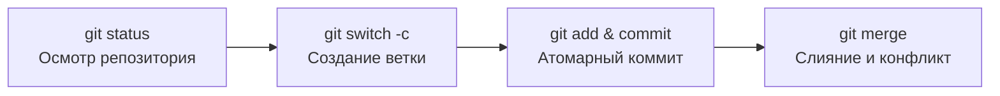

# HSE DevOps: Практическое введение в Git

Добро пожаловать в репозиторий первого практического занятия курса **«Инструменты разработки и DevOps»** (НИУ ВШЭ — Санкт-Петербург, Fall 2026).

Этот проект служит стартовой площадкой для знакомства с распределённой системой контроля версий Git и предназначен для прохождения вводной **welcome-сессии**.

---

## 🎯 Welcome-сессия: Быстрый старт

Перед началом практической работы выполните шаги первичной подготовки:

### 1. Чек-лист подготовки к занятию
- [x] Подключиться к видеоконференции (Zoom / Webinar по ссылке из расписания)
- [x] Найти и склонировать учебный репозиторий к себе на локальную машину
- [x] Проверить установку Git в терминале:
  ```bash
  git --version
  ```

### 2. Клонирование репозитория
```bash
git clone <ссылка_на_репозиторий>
cd 01-git-example
```

### 3. Первичная настройка авторства коммитов
> [!IMPORTANT]
> Настраивайте имя и почту **локально** для учебного репозитория, чтобы не затирать глобальные конфигурации других ваших проектов:

```bash
# Установка имени (латиницей) и корпоративной почты для текущего репозитория
git config user.name "Ivan Ivanov"
git config user.email "iivanov@edu.hse.ru"

# Проверка установленных параметров
git config --list --show-origin
```

---

## 📂 Структура репозитория

| Файл / Каталог | Описание |
| :--- | :--- |
| [`README.md`](./README.md) | Главная страница репозитория с регламентом welcome-сессии и инструкцией |
| [`docs/`](./docs/README.md) | **Интерактивная книга по Git:** пошаговые главы от настройки до rebase |
| [`CACHED.md`](./CACHED.md) | Учебный файл для отработки удаления файлов из индекса (`git rm --cached`) |

---

## 🧪 Сценарий первой практической работы

Во время welcome-сессии отрабатываются следующие базовые этапы работы с Git:



1. **Осмотр истории и состояния проекта:**
   ```bash
   git status
   git log --graph --oneline --all
   ```
2. **Создание feature-ветки по безопасным практикам:**
   Создавайте ветку с явным указанием базовой ветки:
   ```bash
   git switch -c feature/my-first-change main
   ```
3. **Внесение правок и фиксация:**
   Используйте осознанную индексацию (без слепого `commit -am`):
   ```bash
   git diff
   git add <изменённый_файл>
   git commit -m "feat: добавлена информация о студенте"
   ```
4. **Отработка слияния веток и разрешения конфликтов:**
   Слияние веток и ручное разрешение меток `<<<<<<<`, `=======`, `>>>>>>>` при возникновении конфликта.

---

## 📖 Документация (Интерактивная книга)

Весь теоретический и практический материал разбит на отдельные главы в каталоге [`docs/`](./docs/README.md):

* 📘 [**Оглавление книги**](./docs/README.md)
* [**Глава 1.** Первоначальная настройка](./docs/01-configuration.md)
* [**Глава 2.** Инициализация и статус](./docs/02-init-and-status.md)
* [**Глава 3.** Индексация и коммиты](./docs/03-staging-and-commits.md)
* [**Глава 4.** История коммитов](./docs/04-history-and-log.md)
* [**Глава 5.** Ветвление и переключение](./docs/05-branching-and-checkout.md)
* [**Глава 6.** Слияние и конфликты](./docs/06-merging-and-conflicts.md)
* [**Глава 7.** Отмена изменений](./docs/07-undoing-changes.md)
* [**Глава 8.** Перебазирование (Rebase)](./docs/08-rebase.md)

---

## 🙏 Acknowledgments

Мы выражаем искреннюю благодарность филиалу **НИУ ВШЭ — Санкт-Петербург** за организацию и проведение курса.
