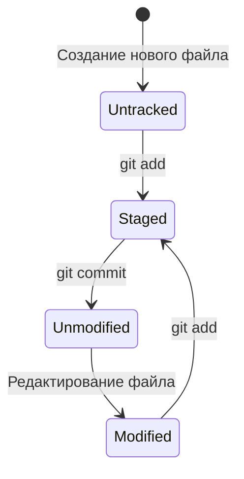

[📖 Оглавление](./README.md) / **Глава 2**

---

# Глава 2. Инициализация и статус (Init & Status)

В этой главе рассматриваются команды создания репозитория и отслеживания состояния файлов в рабочей директории и индексе.

---

## 1. Инициализация репозитория: `git init`

Любая работа с Git начинается с превращения обычной папки на диске в версионируемый Git-репозиторий.

```bash
# Инициализировать репозиторий в текущей директории
git init
```

### Что происходит при `git init`?
Внутри каталога создаётся скрытая директория `.git`. В ней Git хранит:
* Всю историю коммитов и объекты (коммиты, деревья, блобы);
* Указатели на ветки и теги (`refs`);
* Индекс (staging area);
* Локальные настройки проекта (`.git/config`).

Если удалить каталог `.git`, проект перестанет быть репозиторием, превратившись в обычный набор файлов на диске.

---

## 2. Жизненный цикл файлов в Git

Файлы в вашем проекте могут находиться в одном из четырёх основных состояний:



1. **Untracked (неотслеживаемый):** новый файл, о котором Git ещё ничего не знает.
2. **Unmodified (неизменённый):** файл уже зафиксирован в коммите и не менялся в рабочей директории.
3. **Modified (изменённый):** файл был отредактирован, но изменения ещё не добавлены в индекс.
4. **Staged (подготовленный / проиндексированный):** изменения зафиксированы в индексе и войдут в следующий коммит.

---

## 3. Проверка статуса: `git status`

Команда `git status` — самая часто используемая команда. Она показывает, в каком состоянии находится проект:

```bash
git status
```

Вывод команды подсказывает:
* На какой ветке вы сейчас находитесь;
* Есть ли расхождения с базовой веткой;
* Какие файлы подготовлены к коммиту (зелёный цвет);
* Какие файлы изменены, но ещё не в индексе (красный цвет);
* Какие файлы не отслеживаются (`Untracked files`).

---

## 4. Просмотр различий: `git diff`

Команда `git diff` позволяет увидеть точные построчные изменения в файлах.

### Разница между рабочей директорией и индексом:
```bash
# Показывает изменения в файлах, которые ещё НЕ добавлены через git add
git diff
```

### Разница между индексом и последним коммитом:
```bash
# Показывает изменения, которые УЖЕ добавлены в индекс и войдут в следующий коммит
git diff --staged

# Полный аналог:
git diff --cached
```

---

[⬅ Глава 1: Настройка](./01-configuration.md) | [📖 К оглавлению](./README.md) | [Глава 3: Индексация и коммиты ➡](./03-staging-and-commits.md)
