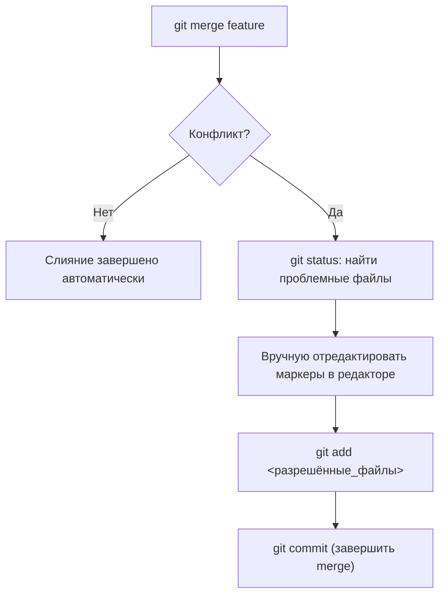

[📖 Оглавление](./README.md) / **Глава 6**

---

# Глава 6. Слияние веток и конфликты (Merging & Conflicts)

Когда разработка в отдельной ветке завершена, её изменения необходимо объединить с основной веткой проекта. В этой главе рассматривается процесс слияния и алгоритм разрешения конфликтов.

---

## 1. Команда слияния: `git merge`

Чтобы влить изменения из ветки `feature/login` в текущую ветку `main`:

```bash
# 1. Переключаемся в ветку, КУДА будем вливать
git switch main

# 2. Вызываем слияние ветки, ОТКУДА берём изменения
git merge feature/login
```

### Виды слияния:
1. **Fast-Forward (перемотка вперёд):** если в `main` с момента создания ветки не появилось новых коммитов, Git просто перемещает указатель `main` на конец `feature/login`. Отдельный merge-коммит не создаётся.
2. **3-Way Merge (трёхстороннее слияние):** если в обеих ветках появились независимые коммиты, Git создаёт специальный **merge-коммит** с двумя родителями.

---

## 2. Анатомия конфликта слияния

Конфликт возникает, когда одни и те же строки в одном и том же файле были изменены по-разному в обеих ветках. В этом случае Git не может автоматически решить, какой вариант верный, и приостанавливает слияние.

Внутри конфликтующих файлов появляются специальные маркеры:

```text
<<<<<<< HEAD
Код из текущей ветки (например, main)
=======
Код из вливаемой ветки (например, feature/login)
>>>>>>> feature/login
```

---

## 3. Пошаговый алгоритм разрешения конфликта



1. **Определить конфликтующие файлы:**
   ```bash
   git status
   ```
   Файлы с конфликтами будут помечены как `both modified`.

2. **Отредактировать файлы вручную:**
   Откройте каждый конфликтующий файл, выберите итоговый вариант кода и удалите маркеры `<<<<<<<`, `=======`, `>>>>>>>`.

3. **Отметить конфликт как разрешённый:**
   Добавьте исправленный файл в индекс:
   ```bash
   git add path/to/conflict_file.py
   ```

4. **Завершить слияние коммитом:**
   ```bash
   git commit
   ```
   *(Git сам подставит стандартное сообщение вида `Merge branch 'feature/login' into main`).*

---

## 4. Экстренная отмена слияния: `git merge --abort`

Если в процессе слияния вы запутались или поняли, что ветка пока не готова к слиянию:

```bash
git merge --abort
```

Эта команда мгновенно откатит рабочую директорию и индекс в то состояние, в котором они были до запуска `git merge`.

---

[⬅ Глава 5: Ветки и переключение](./05-branching-and-checkout.md) | [📖 К оглавлению](./README.md) | [Глава 7: Отмена изменений ➡](./07-undoing-changes.md)
