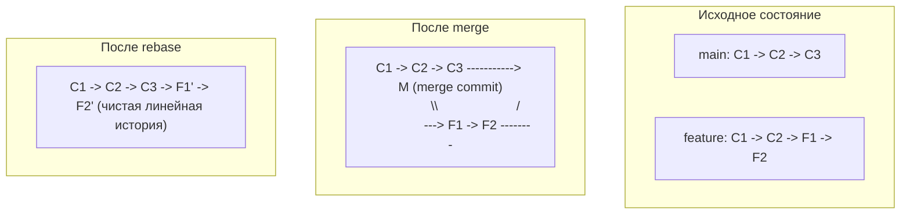

[📖 Оглавление](./README.md) / **Глава 8**

---

# Глава 8. Перебазирование веток (Git Rebase)

`git rebase` (перебазирование) — это мощный инструмент управления историей коммитов, позволяющий переносить цепочку коммитов поверх новой базы и наводить порядок в локальной истории.

---

## 1. Rebase vs Merge: в чём разница?

* **`git merge`**: сохраняет историческую достоверность ветвления, создавая специальный **merge-коммит** с двумя родителями. При частых слияниях история превращается в сложное нелинейное переплетение веток («паутину»).
* **`git rebase`**: переносит коммиты вашей ветки и последовательно накатывает их поверх целевой ветки. В результате история становится абсолютно **линейной**, чистой и удобной для чтения.



---

## 2. Базовое перебазирование

Сценарий: вы работали в ветке `feature/auth`, пока в `main` появились новые коммиты. Чтобы актуализировать вашу ветку относительно свежего `main`:

```bash
# 1. Переключитесь на свою ветку
git switch feature/auth

# 2. Выполните перебазирование поверх main
git rebase main
```

Или одной командой:
```bash
git rebase main feature/auth
```

---

## 3. Интерактивный Rebase: `git rebase -i`

Интерактивный режим позволяет отредактировать последние локальные коммиты перед отправкой: объединить мелкие исправления, переименовать невнятные сообщения или удалить лишнее.

```bash
# Редактировать последние 3 коммита текущей ветки
git rebase -i HEAD~3

# Редактировать все коммиты ветки относительно main
git rebase -i main
```

Git откроет текстовый редактор со списком коммитов в **хронологическом порядке** (сверху вниз — от старых к новым):

```text
pick 1a2b3c4 feat: добавлен каркас авторизации
pick 5d6e7f8 fix: исправлена опечатка
pick 9a0b1c2 test: добавлены тесты
```

### Команды интерактивного режима:
| Команда | Сокращение | Назначение |
| :--- | :--- | :--- |
| **`pick`** | `p` | Использовать коммит как есть |
| **`reword`** | `r` | Изменить только сообщение коммита |
| **`edit`** | `e` | Остановить процесс для изменения файлов в коммите (`git commit --amend`) |
| **`squash`** | `s` | Объединить коммит с предыдущим и склеить их описания |
| **`fixup`** | `f` | Объединить с предыдущим, выбросив текущее описание (идеально для фиксов опечаток) |
| **`drop`** | `d` | Удалить коммит из истории (или стереть строку) |

*Перемещение строк местами меняет хронологический порядок коммитов.*

---

## 4. Разрешение конфликтов при Rebase

В процессе rebase каждый коммит применяется отдельно, шаг за шагом. Если на каком-то коммите возникает конфликт:

1. Git приостанавливает перебазирование и сообщает имя проблемного файла.
2. Откройте файл и разрешите конфликт вручную (удалите маркеры `<<<<<<<`, `=======`, `>>>>>>>`).
3. Добавьте файл в индекс:
   ```bash
   git add path/to/conflict_file.py
   ```
4. Продолжите перебазирование (**НЕ используйте `git commit`**):
   ```bash
   git rebase --continue
   ```

### Управление процессом rebase:
* `git rebase --abort` — немедленно прервать операцию и вернуть ветку в первоначальное состояние.
* `git rebase --skip` — пропустить проблемный коммит (изменения этого коммита будут выброшены).

---

## 5. Золотое правило Rebase (The Golden Rule)

> [!CAUTION]
> **Никогда не делайте `rebase` коммитов, которые уже отправлены в публичный репозиторий и с которыми работают другие разработчики!**

### В чём опасность?
Команда `rebase` не переносит коммиты физически — она создаёт **новые объекты коммитов с новыми SHA-хэшами**. Если другие люди уже отпочковались от ваших опубликованных коммитов, их локальная история разойдётся с удалённой, возникнет масса дублирующихся коммитов и сложнейшие конфликты при последующих слияниях.

**Главное правило:**
* Для **локальных личных веток** до отправки на сервер — `rebase` является лучшей практикой.
* Для **общих публичных веток** (`main`, `master`, релизные ветки) — используйте исключительно `merge`.

---

## 6. Полезные опции

```bash
# Автоматически спрятать незакоммиченные правки в stash перед rebase и достать после:
git rebase --autostash main

# Пересадить участок ветки на новую базу:
git rebase --onto main feature/old-branch feature/new-branch
```

---

[⬅ Глава 7: Отмена изменений](./07-undoing-changes.md) | [📖 К оглавлению](./README.md)
