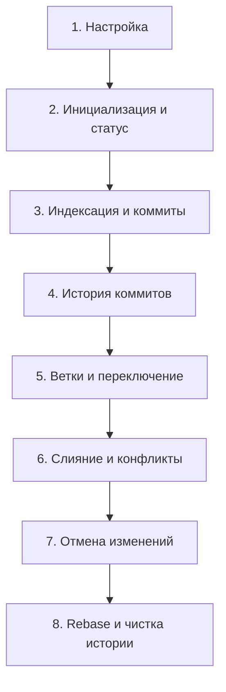

# 📚 Интерактивная книга по Git

Добро пожаловать в учебное руководство по системе контроля версий **Git** в рамках курса **«Инструменты разработки и DevOps»** (НИУ ВШЭ — Санкт-Петербург).

Этот интерактивный справочник организован в виде книги: каждая глава посвящена конкретному этапу работы, снабжена примерами команд, разбором типичных ошибок и удобной навигацией.

---

## 🗺 Оглавление

| Глава | Тема | Ключевые команды и концепции |
| :--- | :--- | :--- |
| [**Глава 1**](./01-configuration.md) | **Первоначальная настройка** | `git config`, уровни `--system`/`--global`/`--local`, антипаттерны настройки авторства |
| [**Глава 2**](./02-init-and-status.md) | **Инициализация и осмотр** | `git init`, `git status`, `git diff`, `git diff --staged` |
| [**Глава 3**](./03-staging-and-commits.md) | **Индексация и коммиты** | `git add`, `git rm --cached`, `git commit -m`, опасность `commit -am`, `commit --amend` |
| [**Глава 4**](./04-history-and-log.md) | **Просмотр истории** | `git log`, `git log --oneline`, `git log --graph --all`, `git show` |
| [**Глава 5**](./05-branching-and-checkout.md) | **Ветвление и переключение** | `git branch`, `git switch` vs `checkout`, риски и минусы `switch -c` / `checkout -b` |
| [**Глава 6**](./06-merging-and-conflicts.md) | **Слияние и конфликты** | `git merge`, маркеры `<<<<<<<`, пошаговый алгоритм разрешения, `merge --abort` |
| [**Глава 7**](./07-undoing-changes.md) | **Отмена изменений** | `git restore`, `git restore --staged`, сравнение со старыми командами `reset` и `checkout` |
| [**Глава 8**](./08-rebase.md) | **Перебазирование (Rebase)** | `git rebase`, сравнение с `merge`, интерактивный режим `-i`, золотое правило Rebase |

---

## 💡 Как пользоваться этим справочником

1. **Последовательное чтение:** если вы только знакомитесь с Git, рекомендуется читать главы по порядку, начиная с [Главы 1](./01-configuration.md). Внизу каждой страницы есть ссылки для быстрого перехода к следующей главе.
2. **Точечный поиск:** если вам нужно вспомнить конкретную команду или нюанс (например, как разрешить конфликт или почистить историю коммитов), выберите соответствующую главу из таблицы выше.
3. **Цветовые акценты и предупреждения:**
   * > [!IMPORTANT] Важные правила оформления и рабочего процесса.
   * > [!WARNING] Частые ошибки и опасные практики.
   * > [!CAUTION] Действия, способные привести к потере данных или порче истории проекта.

---

[🚀 Начать обучение: Глава 1. Первоначальная настройка ➡](./01-configuration.md)
